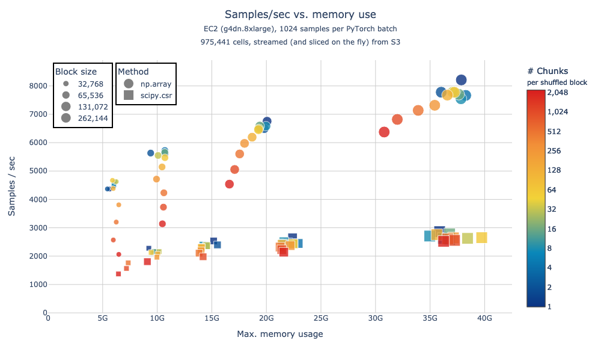
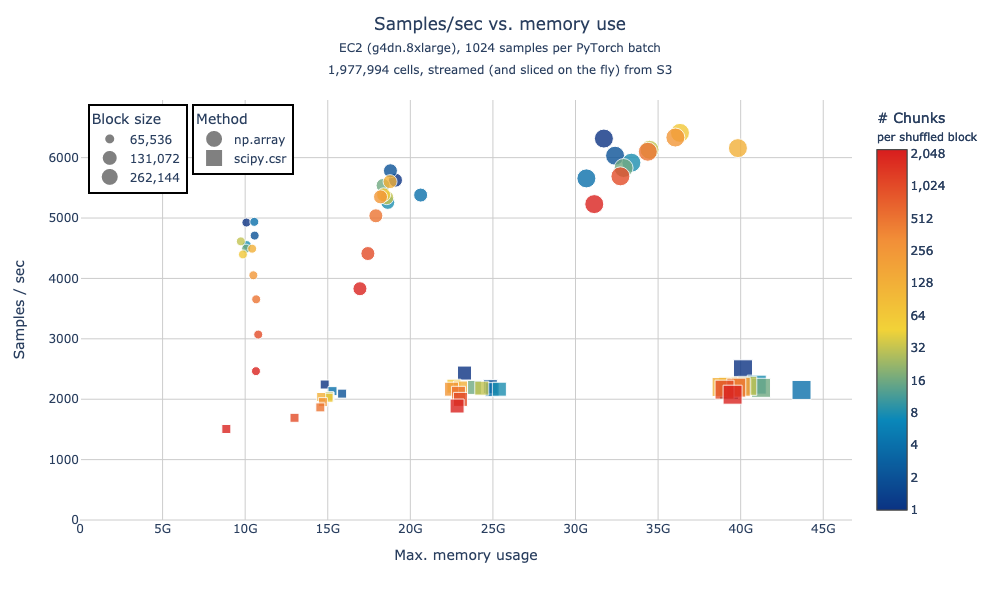
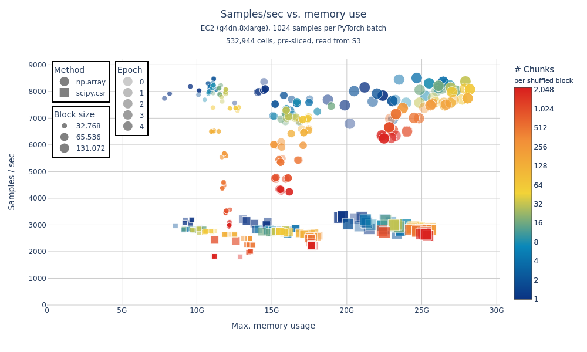

# `arrayloader-benchmarks`

This fork of [laminlabs/arrayloader-benchmarks] digs further into timings from "[A large-scale benchmark]" / [Plot Figure 1.ipynb](Plot%20Figure%201.ipynb).

<!-- toc -->

- [Install](#install)
- [`alb data-loader`](#alb-data-loader)
  * [Streaming+Slicing from Census](#streamingslicing-from-census)
    + [≈1e6 cells](#%E2%89%881e6-cells)
    + [≈2e6 cells](#%E2%89%882e6-cells)
  * [Pre-sliced Census subsets, streamed from S3](#pre-sliced-census-subsets-streamed-from-s3)
    + [≈3e5 cells x 5 epochs](#%E2%89%883e5-cells-x-5-epochs)
    + [≈5e5 cells x 5 epochs](#%E2%89%885e5-cells-x-5-epochs)
- [Other utilities](#other-utilities)
  * [Prepare a local dataset](#prepare-a-local-dataset)
  * [Reading SOMA chunks with various "shuffle" strategies](#reading-soma-chunks-with-various-shuffle-strategies)
  * [No shuffle](#no-shuffle)
  * [Intra-chunk shuffle](#intra-chunk-shuffle)
  * [Global shuffle](#global-shuffle)

<!-- tocstop -->

## Install
Install this library, as well as [cellxgene-census] and [tiledb-soma] Git submodules:

```bash
pip install \
  -e cellxgene-census/api/python/cellxgene_census \
  -e tiledb-soma/apis/python \
  -e .
```

See also [init-instance.sh] for initial node setup commands:
```bash
. <(curl https://raw.githubusercontent.com/ryan-williams/arrayloader-benchmarks/main/notebooks/init-instance.sh)
```

## `alb data-loader`

Plots below were generated on `g4dn.8xlarge` instances, using:
- [data_loader.py]: generate data ([epochs.parquet])
- [data_loader_nb.py]: generate notebooks / plots ([notebooks/data-loader])

2 "methods" (indicated by marker shape) are tested for converting from TileDB-SOMA / Arrow Tables to dense `torch.Tensor`s:
- `np.array`: directly convert `arrow.Table` to `np.array` ([source][np.array source])
- `scipy.csr`: convert `arrow.Table` to `scipy.sparse.csr_matrix` (existing default behavior; [source][scipy.csr source])

Various shuffle-block sizes are also compared (represented by marker size), as are the underlying SOMA chunk sizes / chunks per block (marker color represents the latter).

### Streaming+Slicing from Census

#### ≈1e6 cells



([Interactive version][s3 s:55])

Generated by:
```bash
alb data-loader -S -e55 -b  '32768 / [1,2048]'  # Shuffled block size 2^15, chunks per block ∈ {2^0, …, 2^11}
alb data-loader -S -e55 -b  '65536 / [1,2048]'  # Shuffled block size 2^16, chunks per block ∈ {2^0, …, 2^11}
alb data-loader -S -e55 -b '131072 / [1,2048]'  # Shuffled block size 2^17, chunks per block ∈ {2^0, …, 2^11}
alb data-loader -S -e55 -b '262144 / [1,2048]'  # Shuffled block size 2^18, chunks per block ∈ {2^0, …, 2^11}
alb data-loader-nb -D s:55                      # Generate plot: first 55 datasets, sorted by increasing cell count
```

Notes:
- `-S`: sort datasets in order of increasing cell count (`dataset_total_cell_count`)
- `-e55`: select the first 55 datasets (totaling ≈1MM cells; see [datasets.ipynb])

#### ≈2e6 cells



([Interactive version][s3 s:85])

Generated by:
```bash
alb data-loader -S -e85 -b  '65536 / [1,2048]'  # Shuffled block size 2^16, chunks per block ∈ {2^0, …, 2^11}
alb data-loader -S -e85 -b '131072 / [1,2048]'  # Shuffled block size 2^17, chunks per block ∈ {2^0, …, 2^11}
alb data-loader -S -e85 -b '262144 / [1,2048]'  # Shuffled block size 2^18, chunks per block ∈ {2^0, …, 2^11}
alb data-loader-nb -D s:85                      # Generate plot: first 85 datasets, sorted by increasing cell count
```

Notes:
- `-S`: sort datasets in order of increasing cell count (`dataset_total_cell_count`)
- `-e85`: select the first 85 datasets (totaling ≈2MM cells; see [datasets.ipynb])

### Pre-sliced Census subsets, streamed from S3

- Plots below reflect runs against pre-sliced subsets of the Census
- 5 epochs are run, for each block-/chunk-size configuration

#### ≈3e5 cells x 5 epochs


([Interactive version][s3 2:9])

```bash
uri=s3://rw-tdb-west2/arrayloader-benchmarks/data/census-benchmark_2:9
alb data-loader -E5 -b  '32768 / [1,2048]' $uri
alb data-loader -E5 -b  '65536 / [1,2048]' $uri
alb data-loader -E5 -b '131072 / [1,2048]' $uri
alb data-loader-nb -D 2:9 -o ec2_s3_2:9
```

#### ≈5e5 cells x 5 epochs



([Interactive version][s3 2:14])

```bash
uri=s3://rw-tdb-west2/arrayloader-benchmarks/data/census-benchmark_2:14
alb data-loader -E5 -b  '32768 / [1,2048]' $uri
alb data-loader -E5 -b  '65536 / [1,2048]' $uri
alb data-loader -E5 -b '131072 / [1,2048]' $uri
alb data-loader-nb -D 2:14 -o ec2_s3_2:14
```

## Other utilities

### Prepare a local dataset
Local copies of subsets of the Census can be generated like:
```bash
# - Open the datasets at index 2 and 3 (slice `2:4`) within collection_id 283d65eb-dd53-496d-adb7-7570c7caa443 (default: `-c 283d65eb-dd53-496d-adb7-7570c7caa443`)
# - Slice the first 20k vars (default: `-v 20_000`)
# - Save to data/census-benchmark_2:3 (default: `-d data`)
alb download -s 2 -e 4
```

Some pre-sliced datasets can be downloaded directly:
```bash
dst=data/census-benchmark_2:4
aws s3 sync s3://rw-tdb-west2/arrayloader-benchmarks/$dst $dst
```

### Reading SOMA chunks with various "shuffle" strategies
See [read_chunks.py]:

### No shuffle
```bash
alb read-chunks data/census-benchmark_2:4
# read_table elapsed: 1.43s
# read_blockwise_table elapsed: 2.33s
# read_blockwise_scipy_coo elapsed: 10.36s
# read_blockwise_scipy_csr elapsed: 13.92s
```

### Intra-chunk shuffle
```bash
alb read-chunks -s data/census-benchmark_2:4
# read_table elapsed: 1.50s
# read_blockwise_table elapsed: 2.70s
# read_blockwise_scipy_coo elapsed: 12.83s
# read_blockwise_scipy_csr elapsed: 19.29s
```

### Global shuffle
```bash
alb read-chunks -ss data/census-benchmark_2:4
# read_table elapsed: 21.04s
# read_blockwise_table elapsed: 21.47s
# read_blockwise_scipy_coo elapsed: 35.60s
# read_blockwise_scipy_csr elapsed: 37.63s
```

[laminlabs/arrayloader-benchmarks]: https://github.com/laminlabs/arrayloader-benchmarks
[A large-scale benchmark]: https://lamin.ai/blog/arrayloader-benchmarks#a-large-scale-benchmark

[cellxgene-census]: cellxgene-census
[tiledb-soma]: tiledb-soma

[np.array source]: https://github.com/ryan-williams/cellxgene-census/blob/0f66b12f4fe75f28d5ab23ea8c078faa84b76963/api/python/cellxgene_census/src/cellxgene_census/experimental/ml/pytorch.py#L113-L121
[scipy.coo source]: https://github.com/ryan-williams/cellxgene-census/blob/0f66b12f4fe75f28d5ab23ea8c078faa84b76963/api/python/cellxgene_census/src/cellxgene_census/experimental/ml/pytorch.py#L372-L379
[scipy.csr source]: https://github.com/ryan-williams/cellxgene-census/blob/0f66b12f4fe75f28d5ab23ea8c078faa84b76963/api/python/cellxgene_census/src/cellxgene_census/experimental/ml/pytorch.py#L202

[data_loader.py]: benchmarks/cli/data_loader.py
[epochs.parquet]: notebooks/data-loader/epochs.parquet
[notebooks/data-loader]: notebooks/data-loader
[data_loader_nb.py]: benchmarks/cli/data_loader_nb.py
[read_chunks.py]: benchmarks/cli/read_chunks.py
[datasets.ipynb]: notebooks/datasets.ipynb

[s3 s:55]: https://rw-tdb.s3-us-west-2.amazonaws.com/arrayloader-benchmarks/notebooks/data-loader/s:55/speed_vs_mem_1.html
[s3 s:85]: https://rw-tdb.s3-us-west-2.amazonaws.com/arrayloader-benchmarks/notebooks/data-loader/s:85/speed_vs_mem_1.html
[s3 2:9]: https://rw-tdb.s3-us-west-2.amazonaws.com/arrayloader-benchmarks/notebooks/data-loader/ec2_s3_2:9/speed_vs_mem_1.html
[s3 2:14]: https://rw-tdb.s3-us-west-2.amazonaws.com/arrayloader-benchmarks/notebooks/data-loader/ec2_s3_2:14/speed_vs_mem_1.html

[init-instance.sh]: notebooks/init-instance.sh
