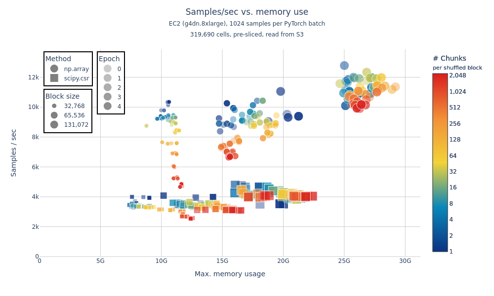

# `arrayloader-benchmarks`

This fork of [laminlabs/arrayloader-benchmarks] digs further into timings from "[A large-scale benchmark]" / [Plot Figure 1.ipynb](Plot%20Figure%201.ipynb).

## Install
Install this library, as well as [cellxgene-census] and [tiledb-soma] Git submodules:

```bash
pip install \
  -e cellxgene-census/api/python/cellxgene_census \
  -e tiledb-soma/apis/python \
  -e .
```

## Prepare a local dataset
Generate a local copy of a small Census slice:
```bash
# - Open the datasets at index 2 and 3 (slice `2:4`) within collection_id 283d65eb-dd53-496d-adb7-7570c7caa443 (default: `-c 283d65eb-dd53-496d-adb7-7570c7caa443`)
# - Slice the first 20k vars (default: `-v 20_000`)
# - Save to data/census-benchmark_2:3 (default: `-d data`)
alb download -s 2 -e 4
```

Or download a pre-sliced dataset:
```bash
dst=data/census-benchmark_2:4
aws s3 sync s3://rw-tdb-west2/arrayloader-benchmarks/$dst $dst
```

## `alb data-loader`

See [data_loader.py] / [notebooks/data-loader]:



The data for this figure was generated by running:

```bash
uri=s3://rw-tdb-west2/arrayloader-benchmarks/data/census-benchmark_2:9
alb data-loader -e5 -b '131072 / [1,2048]' $uri
alb data-loader -e5 -b  '65536 / [1,2048]' $uri
alb data-loader -e5 -b  '32768 / [1,2048]' $uri
```

The figure itself was then generated by [data_loader_nb.py]:
```bash
alb data-loader-nb -D 2:9 --s3 -o ec2_s3_2:9
```

all on a `g4dn.8xlarge` EC2 instance.

- 2 "methods" convert from TileDB-SOMA / Arrow Tables to dense `torch.Tensor`s:
  - `np.array`: directly convert `arrow.Table` to `np.array` ([source][np.array source])
  - `scipy.csr`: convert `arrow.Table` to `scipy.sparse.csr_matrix` (existing default behavior; [source][scipy.csr source])
- 5 epochs each (313 batches x 1024 samples per batch; ≈320k samples in `census-benchmark_2:9`)
- 3 "shuffle block" sizes: $2^{15}$, $2^{16}$, $2^{17}$ (32,768, 65,536, 131,072)
- For each shuffle block size $B$:
  - For each of SOMA chunk size $C \in \{64, 128, \ldots, 131,072\}$:
    - $B/C$ chunks are combined into a "shuffle block" (of total size $B$)

## Reading SOMA chunks with various "shuffle" strategies
See [read_chunks.py]:

### No shuffle
```bash
alb read-chunks data/census-benchmark_2:4
# read_table elapsed: 1.43s
# read_blockwise_table elapsed: 2.33s
# read_blockwise_scipy_coo elapsed: 10.36s
# read_blockwise_scipy_csr elapsed: 13.92s
```

### Intra-chunk shuffle
```bash
alb read-chunks -s data/census-benchmark_2:4
# read_table elapsed: 1.50s
# read_blockwise_table elapsed: 2.70s
# read_blockwise_scipy_coo elapsed: 12.83s
# read_blockwise_scipy_csr elapsed: 19.29s
```

### Global shuffle
```bash
alb read-chunks -ss data/census-benchmark_2:4
# read_table elapsed: 21.04s
# read_blockwise_table elapsed: 21.47s
# read_blockwise_scipy_coo elapsed: 35.60s
# read_blockwise_scipy_csr elapsed: 37.63s
```

[laminlabs/arrayloader-benchmarks]: https://github.com/laminlabs/arrayloader-benchmarks
[A large-scale benchmark]: https://lamin.ai/blog/arrayloader-benchmarks#a-large-scale-benchmark

[cellxgene-census]: cellxgene-census
[tiledb-soma]: tiledb-soma

[np.array source]: https://github.com/ryan-williams/cellxgene-census/blob/0f66b12f4fe75f28d5ab23ea8c078faa84b76963/api/python/cellxgene_census/src/cellxgene_census/experimental/ml/pytorch.py#L113-L121
[scipy.coo source]: https://github.com/ryan-williams/cellxgene-census/blob/0f66b12f4fe75f28d5ab23ea8c078faa84b76963/api/python/cellxgene_census/src/cellxgene_census/experimental/ml/pytorch.py#L372-L379
[scipy.csr source]: https://github.com/ryan-williams/cellxgene-census/blob/0f66b12f4fe75f28d5ab23ea8c078faa84b76963/api/python/cellxgene_census/src/cellxgene_census/experimental/ml/pytorch.py#L202

[data_loader.py]: benchmarks/cli/data_loader.py
[notebooks/data-loader]: notebooks/data-loader
[data_loader_nb.py]: benchmarks/cli/data_loader_nb.py
[read_chunks.py]: benchmarks/cli/read_chunks.py
