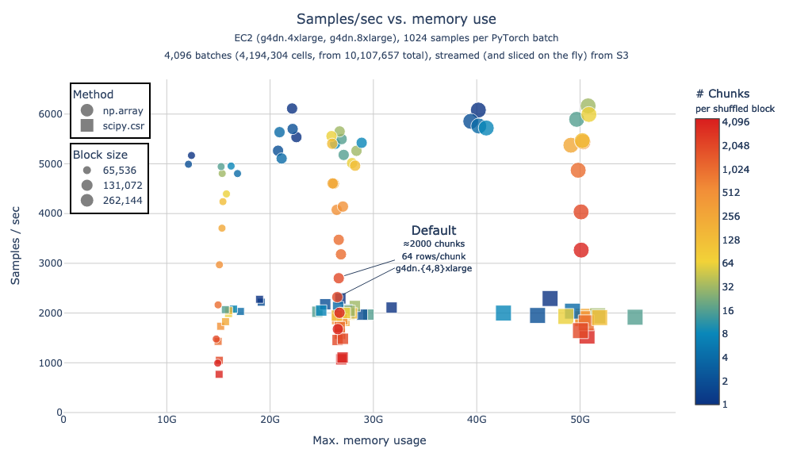

# `arrayloader-benchmarks`

Cellxgene-census PyTorch data-loading benchmarks; see also [First stable iteration of Census (SOMA) PyTorch loaders][article].

These benchmarks were used to validate performance improvements to shuffling behavior introduced in [cellxgene-census#1188]; see also [#1169][cellxgene-census#1169], [#1224][cellxgene-census#1224].

This repo was originally forked from [laminlabs/arrayloader-benchmarks], to investigate timings from "[A large-scale benchmark]" / [Plot Figure 1.ipynb](Plot%20Figure%201.ipynb).

<!-- toc -->

- [Install](#install)
- [`alb data-loader`](#alb-data-loader)
  * [Streaming+Slicing from Census](#streamingslicing-from-census)
    + [Generate data](#generate-data)
    + [Generate plot](#generate-plot)
- [Other utilities](#other-utilities)
  * [Prepare a local dataset](#prepare-a-local-dataset)
  * [Reading SOMA chunks with various "shuffle" strategies](#reading-soma-chunks-with-various-shuffle-strategies)
  * [No shuffle](#no-shuffle)
  * [Intra-chunk shuffle](#intra-chunk-shuffle)
  * [Global shuffle](#global-shuffle)

<!-- tocstop -->

## Install
Install this library, as well as [cellxgene-census] and [tiledb-soma] Git submodules:

```bash
pip install \
  -e cellxgene-census/api/python/cellxgene_census \
  -e tiledb-soma/apis/python \
  -e .
```

See also [init-instance.sh] for initial node setup commands:
```bash
. <(curl https://raw.githubusercontent.com/ryan-williams/arrayloader-benchmarks/main/notebooks/init-instance.sh)
```

## `alb data-loader`

Plot below was generated on `g4dn.4xlarge` `g4dn.8xlarge` instances, using:
- [data_loader.py]: generate data ([epochs.parquet])
- [data_loader_nb.py]: execute [notebooks/data-loader/nb.ipynb], generate plots

2 "chunk methods" (indicated by marker shape) are tested for converting from TileDB-SOMA / Arrow Tables to dense `torch.Tensor`s:
- `np.array`: directly convert `arrow.Table` to `np.array` ([source][np.array source]; this is the default, as of [cellxgene-census#1224])
- `scipy.csr`: convert `arrow.Table` to `scipy.sparse.csr_matrix` ([source][scipy.csr source]; this was the previous default behavior)

Various shuffle-block sizes are also compared (represented by marker size), as are the underlying SOMA chunk sizes / chunks per block (marker color represents the latter).

### Streaming+Slicing from Census



([Interactive version][s3 :138_4096])

#### Generate data
```bash
# On a g4dn.4xlarge instance
alb data-loader -e138 -b  '65536 / [1,4096]'  # Shuffled block size 2^16, chunks per block ∈ {2^0, …, 2^12}
alb data-loader -e138 -b '131072 / [1,4096]'  # Shuffled block size 2^17, chunks per block ∈ {2^0, …, 2^12}

# On a g4dn.8xlarge instance
alb data-loader -e138 -b '131072 / [1,4096]'  # Shuffled block size 2^17, chunks per block ∈ {2^0, …, 2^12}
alb data-loader -e138 -b '262144 / [1,4096]'  # Shuffled block size 2^18, chunks per block ∈ {2^0, …, 2^12}
```

Notes:
- `-e138`: select the first 55 datasets (totaling ≈1MM cells; see [datasets.ipynb])
- `-b '131072 / [1,4096]'` (and similar): for each $chunks_per_block \in \{2^0, \ldots, 2^{12}\}$, create blocks of size $2^{17}$ (implying $chunk_size \in \{2^{17}, \ldots, 2^5\}$)

#### Generate plot
```bash
# Generate plot from epochs.parquet rows benchmarking 4096 batches from all 138 human datasets
alb data-loader-nb -D:138 -n4096
```

## Other utilities
Previous experiments in this repo benchmarked Census data-loading when reading from local copies of Census (vs. streaming from S3), and slicing rows/cols *before* benchmarking (as was done for other methods in [A large-scale benchmark]).

Reading from local disk was found not to matter much, but "pre-slicing" corresponded to a 2-3x speedup. A few scripts associated with those experiments are described below.

### Prepare a local dataset
Local copies of subsets of the Census can be generated like:
```bash
# - Open the datasets at index 2 and 3 (slice `2:4`) within collection_id 283d65eb-dd53-496d-adb7-7570c7caa443 (default: `-c 283d65eb-dd53-496d-adb7-7570c7caa443`)
# - Slice the first 20k vars (default: `-v 20_000`)
# - Save to data/census-benchmark_2:3 (default: `-d data`)
alb download -s 2 -e 4
```

Some pre-sliced datasets can be downloaded directly:
```bash
dst=data/census-benchmark_2:4
aws s3 sync s3://rw-tdb-west2/arrayloader-benchmarks/$dst $dst
```

### Reading SOMA chunks with various "shuffle" strategies
See [read_chunks.py]:

### No shuffle
```bash
alb read-chunks data/census-benchmark_2:4
# read_table elapsed: 1.43s
# read_blockwise_table elapsed: 2.33s
# read_blockwise_scipy_coo elapsed: 10.36s
# read_blockwise_scipy_csr elapsed: 13.92s
```

### Intra-chunk shuffle
```bash
alb read-chunks -s data/census-benchmark_2:4
# read_table elapsed: 1.50s
# read_blockwise_table elapsed: 2.70s
# read_blockwise_scipy_coo elapsed: 12.83s
# read_blockwise_scipy_csr elapsed: 19.29s
```

### Global shuffle
```bash
alb read-chunks -ss data/census-benchmark_2:4
# read_table elapsed: 21.04s
# read_blockwise_table elapsed: 21.47s
# read_blockwise_scipy_coo elapsed: 35.60s
# read_blockwise_scipy_csr elapsed: 37.63s
```

[article]: https://chanzuckerberg.github.io/cellxgene-census/articles/2024/20240709-pytorch.html
[laminlabs/arrayloader-benchmarks]: https://github.com/laminlabs/arrayloader-benchmarks
[A large-scale benchmark]: https://lamin.ai/blog/arrayloader-benchmarks#a-large-scale-benchmark

[cellxgene-census]: cellxgene-census
[tiledb-soma]: tiledb-soma

[cellxgene-census#1169]: https://github.com/chanzuckerberg/cellxgene-census/pull/1169
[cellxgene-census#1188]: https://github.com/chanzuckerberg/cellxgene-census/pull/1188
[cellxgene-census#1224]: https://github.com/chanzuckerberg/cellxgene-census/pull/1224
[np.array source]: https://github.com/chanzuckerberg/cellxgene-census/blob/v1.15.0/api/python/cellxgene_census/src/cellxgene_census/experimental/ml/pytorch.py#L109-L117
[scipy.csr source]: https://github.com/chanzuckerberg/cellxgene-census/blob/v1.15.0/api/python/cellxgene_census/src/cellxgene_census/experimental/ml/pytorch.py#L208

[data_loader.py]: benchmarks/cli/data_loader.py
[epochs.parquet]: notebooks/data-loader/epochs.parquet
[notebooks/data-loader/nb.ipynb]: notebooks/data-loader/nb.ipynb
[data_loader_nb.py]: benchmarks/cli/data_loader_nb.py
[read_chunks.py]: benchmarks/cli/read_chunks.py
[datasets.ipynb]: notebooks/datasets.ipynb

[s3 :138_4096]: https://rw-tdb.s3-us-west-2.amazonaws.com/arrayloader-benchmarks/notebooks/data-loader/:138_4096/speed_vs_mem_1.html

[init-instance.sh]: notebooks/init-instance.sh
