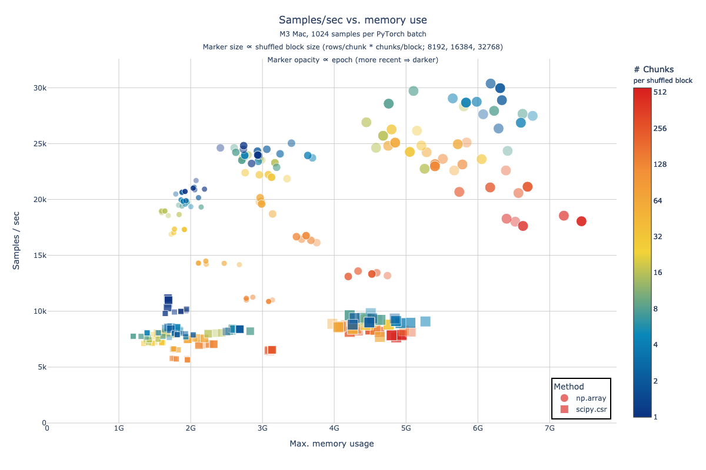
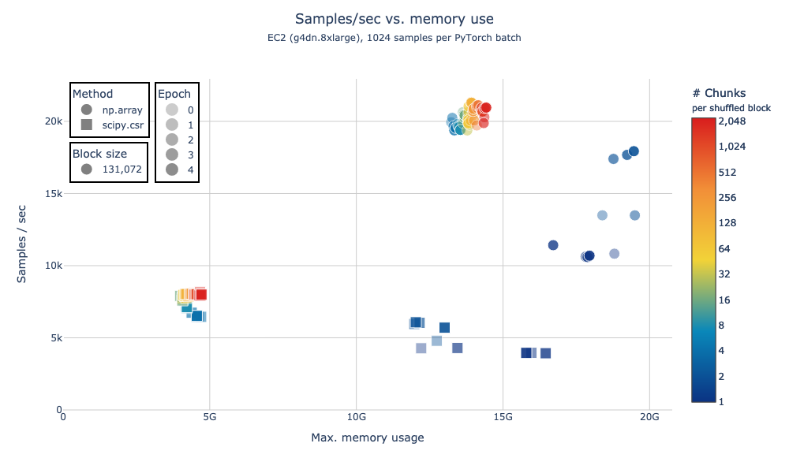

# `arrayloader-benchmarks`

This fork of [laminlabs/arrayloader-benchmarks] digs further into timings from "[A large-scale benchmark]" / [Plot Figure 1.ipynb](Plot%20Figure%201.ipynb).

## Install
Install this library, as well as [cellxgene-census] and [tiledb-soma] Git submodules:

```bash
pip install -e cellxgene-census/api/python/cellxgene_census
pip install -e tiledb-soma/apis/python
pip install -e .
```

## Prepare a local dataset
Generate a local copy of a small Census slice:
```bash
# - Open the datasets at index 2 and 3 (slice `2:4`) within collection_id 283d65eb-dd53-496d-adb7-7570c7caa443 (default: `-c 283d65eb-dd53-496d-adb7-7570c7caa443`)
# - Slice the first 20k vars (default: `-v 20_000`)
# - Save to data/census-benchmark_2:3 (default: `-d data`)
alb download -s 2 -e 4
```

Or download a pre-sliced dataset:
```bash
dst=data/census-benchmark_2:4
aws s3 sync s3://rw-tdb-west2/arrayloader-benchmarks/$dst $dst
```

## `alb data-loader`

See [benchmarks/cli/data_loader.py](benchmarks/cli/data_loader.py) / [notebooks/data-loader-stats](notebooks/data-loader-stats):


<details><summary>Combined plot</summary>


</details>

### 6 epochs x 5 chunk sizes x 3 formats

The data for the figure above was generated by running `alb data-loader` as follows:

```bash
dst=data/census-benchmark_2:7
aws s3 sync s3://rw-tdb-west2/arrayloader-benchmarks/$dst $dst
time alb data-loader -e6 -C -c 1024,2048,4096,8192,16384 $dst
```

- 3 formats, representing different methods of moving from TileDB-SOMA / Arrow Table to dense `torch.Tensor`:
  - `""`: directly convert `arrow.Table` to `np.array` ([source][np.array source])
  - `-s`: convert `arrow.Table` to `scipy.sparse.coo_matrix` ([source][scipy.coo source])
  - `-ss`: convert `arrow.Table` to `scipy.sparse.csr_matrix` ([source][scipy.csr source])
- 5 epochs each (130 batches x 1024 samples per batch; ≈130k samples in `census-benchmark_2:7`)
- 5 SOMA chunk sizes (1024, 2048, 4096, 8192, 16384)

### Plotting
The figure above was generated by running:

```bash
notebooks/data-loader-stats/run-nb.sh m3
```

on my M3 macbook. [A similar one](notebooks/data-loader-stats/azl) was generated using on an Amazon Linux EC2 instance, running the `bash` loops above followed by:
```bash
notebooks/data-loader-stats/run-nb.sh azl
```

<details><summary>Plot</summary>


</details>

<details><summary>Combined plot</summary>


</details>

## Reading SOMA chunks with various "shuffle" strategies
See [benchmarks/cli/read_chunks.py](benchmarks/cli/read_chunks.py):

### No shuffle
```bash
alb read-chunks data/census-benchmark_2:4
# read_table elapsed: 1.43s
# read_blockwise_table elapsed: 2.33s
# read_blockwise_scipy_coo elapsed: 10.36s
# read_blockwise_scipy_csr elapsed: 13.92s
```

### Intra-chunk shuffle
```bash
alb read-chunks -s data/census-benchmark_2:4
# read_table elapsed: 1.50s
# read_blockwise_table elapsed: 2.70s
# read_blockwise_scipy_coo elapsed: 12.83s
# read_blockwise_scipy_csr elapsed: 19.29s
```

### Global shuffle
```bash
alb read-chunks -ss data/census-benchmark_2:4
# read_table elapsed: 21.04s
# read_blockwise_table elapsed: 21.47s
# read_blockwise_scipy_coo elapsed: 35.60s
# read_blockwise_scipy_csr elapsed: 37.63s
```

[laminlabs/arrayloader-benchmarks]: https://github.com/laminlabs/arrayloader-benchmarks
[A large-scale benchmark]: https://lamin.ai/blog/arrayloader-benchmarks#a-large-scale-benchmark

[cellxgene-census]: cellxgene-census
[tiledb-soma]: tiledb-soma

[np.array source]: https://github.com/ryan-williams/cellxgene-census/blob/0f66b12f4fe75f28d5ab23ea8c078faa84b76963/api/python/cellxgene_census/src/cellxgene_census/experimental/ml/pytorch.py#L113-L121
[scipy.coo source]: https://github.com/ryan-williams/cellxgene-census/blob/0f66b12f4fe75f28d5ab23ea8c078faa84b76963/api/python/cellxgene_census/src/cellxgene_census/experimental/ml/pytorch.py#L372-L379
[scipy.csr source]: https://github.com/ryan-williams/cellxgene-census/blob/0f66b12f4fe75f28d5ab23ea8c078faa84b76963/api/python/cellxgene_census/src/cellxgene_census/experimental/ml/pytorch.py#L202
