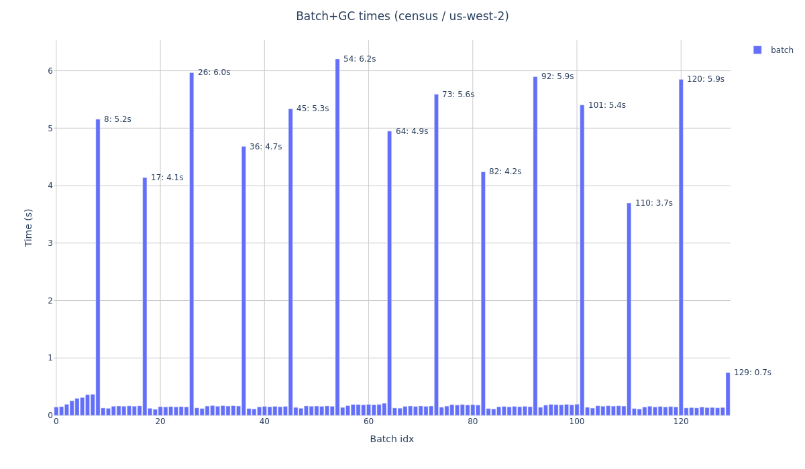

# `arrayloader-benchmarks`

This fork of [laminlabs/arrayloader-benchmarks] digs further into timings from "[A large-scale benchmark]" / [Plot Figure 1.ipynb](Plot%20Figure%201.ipynb):


Observations / areas for further investigation:
- Every ≈10th Census batch took ≈30x the average, accounting for ≈80% of total latency.
- Merlin had 3x slower batches every 10, with an even more rigid pattern.
- MappedCollection batch times tended to repeat every 7 batches, with slower batches often 40-50x slower than average.

## Slowest ≈10% of batches account for most {MappedCollection,Census} latency

[](screenshots/)

Slowest 10% of batches' share of total latency:
- Merlin: 18-25%
- MappedCollection: 50-62%
- Census: 76-81%

<details><summary>See also: [slower batch times] / [faster batch times]</summary>

[](screenshots/)
</details>

## Every 7th or 10th batch was 30x-100x slower

### Merlin
Batch times (colored by [batch index] mod 10):
[](img/merlin_batches_mod10.png)

- In most epochs, every 10th run was ≈3x slower than average
- First epoch was more stable around the overall average, but `1mod10`s were often much *faster*.

<details><summary>Detail: every 10th batch slow</summary>

[](img/merlin_batches_mod10_1200:1800.png)

The first epoch exhibited different "every 10th batch" periodicity.
</details>

### Census
Batch times (colored by [batch index] mod 10):
[](img/census_batches_mod10.png)

Worst 10% of batches were ≈30-40x slower than average

Detail below shows "30x slower" batches repeated roughly every 10, but slipped by 1 every 40-50:

<details><summary>Example slow-batch-gap pattern: 10, 10, 10, 10, 9</summary>

[](img/census_batches_mod10_1200:1800.png)
</details>

### MappedCollection
Batch times (colored by [batch index] mod **7**):
[](img/mappedcollection_batches_mod7.png)

MappedCollection had slow batches every 7 (as opposed to every 10 for the other two methods).

<details><summary>Detail: batch times repeating every 7</summary>

[](img/mappedcollection_batches_mod7_1200:1800.png)
</details>

## Census timing vs. data locality

See [benchmark.ipynb](benchmark.ipynb), and example runs:
- [us-east-1.ipynb](benchmarkes/us-east-1.ipynb): read Census (us-west-2) from an instance in us-east-1
- [us-west-2.ipynb](benchmarkes/us-west-2.ipynb): read Census (us-west-2) from an instance in us-west-2
- [local-nvme.ipynb](benchmarkes/local-nvme.ipynb): read a local copy of Census from an NVMe drive
- [subset-nvme.ipynb](benchmarkes/subset-nvme.ipynb): read a subset of Census from an NVMe drive
- [subset-gp3.ipynb](benchmarkes/subset-gp3.ipynb): read a subset of Census from a gp3 EBS volume

All 5 ran against the same 5 Census datasets (133790 cells), but the "subset" runs read an exported SOMA with just that data (≈714MiB vs. 593GiB); see [download-census-slice.ipynb](download-census-slice.ipynb). 

Rough samples/sec numbers:
```bash
cd results; for f in *.json; do
    echo -n "${f%.json}: "
    jq -j '.census.epochs[0].samples_per_sec | floor' $f
    echo ' samples/sec'
done | column -t | sort -nk2
# us-east-1:    879   samples/sec
# us-west-2:    1393  samples/sec
# local-nvme:   1819  samples/sec
# subset-nvme:  2913  samples/sec
# subset-gp3:   3036  samples/sec
```

Plot images are in [img/](img/), e.g. [img/census-us-west-2.png](img/census-us-west-2.png):



### Repro

<details><summary>Set up instance</summary>

Launch g4dn.8xlarge, [`ami-0a8b4201c73c1b68f`]: (Amazon Linux 2 AMI with NVIDIA TESLA GPU Driver)

```bash
# Clone repo
sudo yum install -y git
git clone git@github.com:ryan-williams/arrayloader-benchmarks.git
cd arrayloader-benchmarks

# Install/Configure Conda+env
. <(curl -L https://j.mp/_rc) runsascoded/.rc  # dotfiles
install_conda  # install Conda, configure libmamba solver
conda env update -n arrayloader-benchmarks -f environment.yml
conda activate arrayloader-benchmarks

# Mount /mnt/nvme
mnt_nvme /dev/nvme1n1 /mnt/nvme

# Download Census
d=cellxgene-census-public-us-west-2/cell-census/2023-12-15/soma
time aws s3 sync s3://$d/ /mnt/nvme/s3/$d/  # ≈50mins, ≈180MiB/s, 593GiB total

# Export Census subset to /mnt/nvme/census-benchmark_2:7
nb=download-census-slice.ipynb
mkdir out
papermill $nb out/$nb
mkdir data
cp -r '/mnt/nvme/census-benchmark_2:7' data/
```

Dotfiles repo: [runsascoded/.rc], [`install_conda`], [`mnt_nvme`]
</details>

#### Run benchmarks
```bash
./execute-nb us-east-1  # from a g4dn.8xlarge in us-east-1
./execute-nb us-west-2  # from a g4dn.8xlarge in us-west-2
./execute-nb local-nvme -p census_uri '/mnt/nvme/s3/cellxgene-census-public-us-west-2/cell-census/2023-12-15/soma'
./execute-nb subset-nvme -p experiment_uri '/mnt/nvme/census-benchmark_2:7' -p n_vars 0  # 20k vars already sliced
./execute-nb subset-gp3 -p experiment_uri 'data/census-benchmark_2:7' -p n_vars 0  # 20k vars already sliced
```

See [execute-nb](execute-nb).

[laminlabs/arrayloader-benchmarks]: https://github.com/laminlabs/arrayloader-benchmarks
[A large-scale benchmark]: https://lamin.ai/blog/arrayloader-benchmarks#a-large-scale-benchmark

[a subset of Census]: download-census-slice.ipynb

[`ami-0a8b4201c73c1b68f`]: https://aws.amazon.com/marketplace/server/fulfillment?ami=ami-0a8b4201c73c1b68f&deliveryMethod=e6724620-3ffb-4cc9-9690-c310d8e794ef&productId=e6724620-3ffb-4cc9-9690-c310d8e794ef&ref_=cfg_full_continue&region=us-east-1&version=6568a2d5-69a5-40ab-affe-0d5735f010d5
[runsascoded/.rc]: https://github.com/runsascoded/.rc
[`install_conda`]: https://github.com/ryan-williams/py-helpers/blob/b7cf68ad76f3cbba66055485a5084121dd3ec839/.py-rc#L418-L449
[`mnt_nvme`]: https://github.com/ryan-williams/aws-helpers/blob/8fd44f731df904269f2d915413e13c75a5fc1af4/.aws-rc#L658-L669
