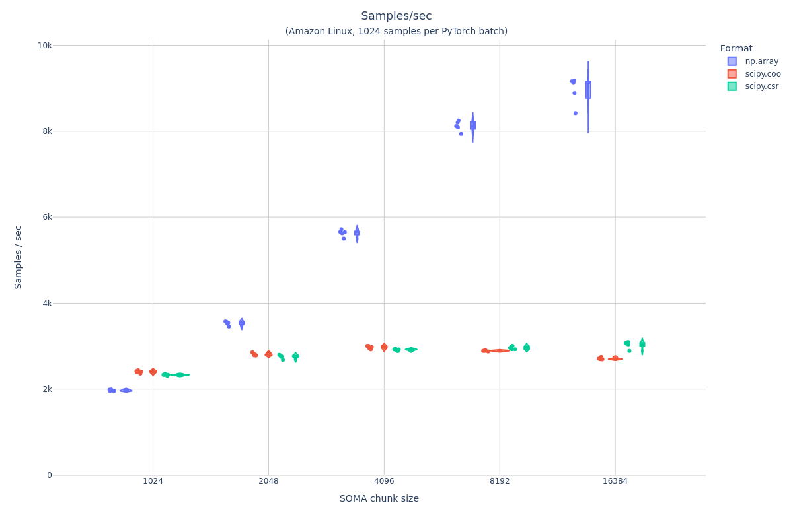

# arrayloader-benchmarks notebooks

## data-loader-stats
See [data-loader-stats.ipynb](data-loader-stats.ipynb), and outputs in [data-loader-stats/](data-loader-stats/).

## data-locality benchmarking
See [benchmark.md](benchmark.md), [benchmark.ipynb](benchmark.ipynb), [benchmarks/](benchmarks).